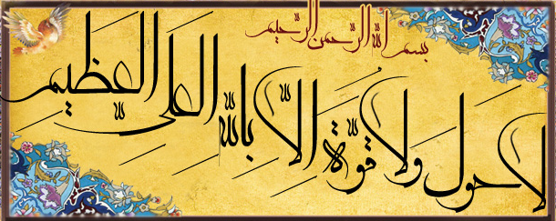

  

I am a Lecturer (~Assistant Professor) in [Natural Language Processing](https://www.sheffield.ac.uk/dcs/research/groups/natural-language-processing) at the Computer Science Department of the University of Sheffield.
Before joining the University of Sheffield, I was a postdoctoral researcher working with Prof. Iryna Gurevych at [the UKP Lab](https://www.informatik.tu-darmstadt.de/ukp/ukp_home/index.en.jsp) at the Technical University of Darmstadt. I got my PhD degree from Heidelberg University where I was supervised by Prof. Michael Strube. I have studied at Alzahra University and the Sharif University of Technology in Tehran for my BSc and MSc in computer science. 

Reseach Interests
------
If you are a self-funded Ph.D. student and would like to work with me, I am interested to work on evaluating and improving (1) fairness & robustness, (2) accessibility, (3) reasoning skills, and (4) efficiency of language models. 
Apart from these, I am interested in coreference resolution and interesting psycholinguistic analyses of text ot multimodal inputs. 

News
------
- April: will serve as a Senior Area Chair for EMNLP2024
- Feb 2024: will serve as an Area chair/Action editor for ACL 2024, and the student volunteer teams co-chair for EMNLP 2024
- Dec 2023: Zahra's paper on "[Spanning the Spectrum of Hatred Detection: A Persian Multi-Label Hate Speech Dataset with Annotator Rationales](https://ojs.aaai.org/index.php/AAAI/article/view/29743)" co-authored with Taher Pilehvar is accepted at AAAI 2024. Zahra is a brilliant undergraduate student at the Tehran Institute for Advanced Studies in Iran
- Nov: Invited talk at Cambridge NLP seminar series
- Oct: [Ajie](https://putama.github.io/), my first PhD student, co-supervised with Iryna Gurevych, defended his thesis. I am very proud of him and his work and wish him all the best.
- Oct 2023: joining the EMNLP2023's Awards Committee for deciding the best papers of the conference
- Oct 2023: Dominic's paper "[Learning From Free-Text Human Feedback -- Collect New Datasets Or Extend Existing Ones?](https://arxiv.org/abs/2310.15758)", with Ye Tian, Nikolai Rozanov, Iryna Gurevych is accepted at EMNLP 2023
- Oct 2023:  invited talk at OFAI's (Austrian Research Institute for AI) 2023 Fall Lecture Series
- Oct 2023:  Our paper "[Scoring Coreference Chains with Split-Antecedent Anaphors](https://journals.uic.edu/ojs/index.php/dad/article/view/12660)", with my amazing co-authors Massimo, Juntao, and Silviu, is published at the Dialogue and Discourse journal
- Nov 2023:  will serve as an area chair for the Lexicon and Semantics track at LREC-COLING 2024
- June 2023: will serve as an area chair of the "Semantics: Lexical, Sentence level, Document Level, Textual Inference, etc." trackat EMNLP 2023
- June 2023: will serve as a workshop co-chair for EACL 2024 
- June 2023: gave a talk on end-to-end reasoning at Bristol
- June 2023: Dominic's paper on "[Arithmetic-Based Pretraining -- Improving Numeracy of Pretrained Language Models](https://arxiv.org/abs/2205.06733)" is accepted at *SEM
- May 2023: Jasivan's first PhD work "[FERMAT: An Alternative to Accuracy for Numerical Reasoning](https://arxiv.org/abs/2305.17491)" is accepted at ACL as a long paper
- April 2023: "The Universal Anaphora Scorer 2.0" with Juntao Yu, Michal Novák, Abdulrahman Aloraini, Silviu Paun, Sameer Pradhan and Massimo Poesiois is accepted at IWCS 2023
- Jan 2023: two papers accepted at EACL: "[Transformers with Learnable Activation Functions](https://aclanthology.org/2023.findings-eacl.181/)" with Haishuo Fang, Ji-Ung Lee, and Iryna Gurevych accepted at findings, and "[Lessons Learned from a Citizen Science Project for Natural Language Processing](https://aclanthology.org/2023.eacl-main.261/)" with Jan-Christoph Klie, Ji-Ung Lee, Kevin Stowe, Gözde Şahin, Luke Bates, Dominic Petrak, Richard Eckart de Castilho and Iryna Gurevych accepted at main

